## About

I build applied AI and data systems for health, language and climate work in Africa. I design the architecture, write the pipelines and test each system with the people who will use it: lab staff, health workers and native speakers.

I founded [Neuravox Foundation](https://neuravox.org), a nonprofit technology organisation in Kampala, and I lead its technical work. I also founded the [Institute for Frontier AI Safety](https://ifasresearch.org). I am completing an MSc in Data Science at the University of East London.

Eight years of field and government work showed me what happens when a model leaves the laptop. The network drops. Data arrives late. A wrong forecast costs a clinic its stock. My applied AI work starts from those conditions.

## Selected work

### ProDrome · laboratory early warning for outbreaks

ProDrome reads weekly laboratory totals and compares each week with the same lab's past year. It flags unusual rises in positive tests, lab operation problems such as late results or failed quality checks, and missing reports. An alert fires when a change persists or several indicators agree. A surveillance officer then marks the alert verified or dismissed. Only aggregate counts leave the lab, so no patient record moves.

I test the detection logic on three data sources. WHO FluNet gives an authentic time series for Uganda. Public Health Scotland data acts as an external benchmark. Synthetic lab data supplies known outbreak events, so I can measure each alert rule against ground truth. ProDrome is open source under Apache 2.0.

[**prodrome.health**](https://prodrome.health)

### VoiceLink · speech data for Luganda and Ateso

VoiceLink turns long radio archives and live call-ins into clean speech datasets for African languages. A Mozilla Common Voice grant funded the build, and I led it as technical lead.

The Python and FastAPI pipeline removes duplicate files with SHA-256 hashes, cuts speech into 3 to 15 second clips with Silero VAD, filters by language and prepares 16 kHz audio. Twilio captures live calls. A Next.js dashboard on Cloudflare Workers reads pipeline status from Supabase.

I built a review platform where native speakers correct transcripts, code rejections and sign each edit. A stratified audit of 300 clips gave the estimate of usable hours. I compared four ASR systems and chose a Luganda Whisper model for draft transcripts.

[**voicelink-core**](https://github.com/8iddy/voicelink-core) &nbsp;

### Offline AI for health supply chains · Uganda Ministry of Health

As Principal Investigator on a £75,000 Elrha/FCDO grant, I designed an AI system for health commodity supply with Uganda's Ministry of Health. A field baseline in 10 facilities showed a strong link between storage capacity and stockouts (r = −0.695). That result moved the design offline first: critical work stays on the device and syncs when a connection returns.

Facilities run rule-based forecasts on the device. Districts run hierarchical exponential smoothing in Docker and PostgreSQL. The national tier runs XGBoost and Random Forest models through Apache Airflow. Health workers can override every recommendation. I wrote the interoperability specification for DHIS2, eLMIS, eAFYA and CSSP over REST, FHIR and batch ETL, plus the database schemas, developer manual, fraud controls and governance guidance. A workshop with 34 government and partner stakeholders validated the framework, and the Ministry of Health endorsed it.

**SupplyEdge** puts the facility tier into an Android app. Kotlin, Jetpack Compose and Room store stock, consumption, forecasts, overrides and audit events on the phone. A pure Kotlin engine computes the forecasts. Staff can speak to the app: an on-device model such as Gemma 3n maps speech to one of six allowed actions. Each action passes typed validation and human confirmation before the app saves it. The model has no access to the database or the network. WorkManager queues records and syncs them when the network returns. The app collects no patient data.

[**supplyedge**](https://github.com/8iddy/supplyedge) · [**ai-framework-docs**](https://github.com/8iddy/ai-framework-docs) &nbsp;

### DAVARS · agricultural risk index

DAVARS gives five districts in Northern Uganda a monthly risk score from 0 to 100: Gulu, Arua, Lira, Oyam and Nebbi. The Python pipeline combines five sub-indices. WFP VAM supplies price volatility, NASA POWER supplies climate stress, FAOSTAT supplies yield instability, ACLED supplies shocks and IFDC supplies fertiliser costs. A month counts as high risk when the score crosses that district's own threshold. A static Plotly.js dashboard on Cloudflare Pages shows the scores, the breakdown, the validation and a monthly bulletin.

[**davars.org**](https://davars.org) · [**agric_risk_index**](https://github.com/8iddy/agric_risk_index)

### ClimaChain · climate intelligence for African countries

ClimaChain shows temperature, rainfall, CO₂ and NDVI series for African countries from World Bank indicators and CMIP6 baselines. It writes policy briefs from the loaded data with deterministic rules, and DeepSeek can refine the text. Each data point carries a quality flag: live, estimated or unavailable. Built with Next.js 15 on Cloudflare Workers, Tailwind and Recharts.

[**climachain.online**](https://climachain.online) · [**climachain**](https://github.com/8iddy/climachain)

### Ancestor · source verification for LLM output (2025 to 2026)

Ancestor checks claims in AI-generated text against their sources and returns a trust score from 0 to 100. The Python engine combines retrieval, deterministic rules and transformer NLI. PostgreSQL keeps an audit record for every check and Redis caches results. The service ran on GCP Cloud Run and in air-gapped Docker. In a preliminary test on medical text, the engine found candidate evidence for about 80% of claims, and about 25% reached high semantic support.

[**Failing closed** (paper)](https://doi.org/10.13140/RG.2.2.35539.23844)

### Yesveri · election claim checks

Yesveri compares election claims with official Electoral Commission records and shows the alignment status of each claim.

[**yesveri.online**](https://yesveri.online)

### AI safety and evaluation research

At IFAS I lead a study on agentic AI in resource constrained environments, with a public protocol, working hypotheses and an evaluation plan. As an AIxBio Africa fellow, I built a life cycle risk framework for AI decision support in African primary care. It sets 5 review stages and 12 risk categories, drawn from 22 WHO, NIST, African Union and medical device sources. I am the Uganda Country Representative for AI Safety East Africa.

## Toolkit

## Papers and reports

- Abako, G. L. (2026). [Failing closed: Evaluating evidence support in AI-generated medical text](https://doi.org/10.13140/RG.2.2.35539.23844). Ancestor Lab.
- Abako, G. L. (2026). [Human agency in AI use: Exploratory findings from surveyed generative AI users](https://doi.org/10.13140/RG.2.2.11335.66722). Neuravox Policy Lab.
- Abako, G. L., Kavuma, T., Ajulong, M. G., & Luande, J. (2026). Artificial intelligence framework for strengthening national health supply chain infrastructure in Uganda. Accepted paper, 8th African Conference on Operations and Supply Chain Management.
- Abako, G. L. (2026). Community radio as speech infrastructure for crisis preparedness: A field report from Uganda. Under review, AACL-IJCNLP 2026 workshop.
- Abako, G. L. (2026). Minimum risk checks for AI decision support in African primary care. AIxBio Africa fellowship report.
- Abako, G. L. (2025). AI framework for health supply chain optimization: Technical specifications and governance guidelines. Elrha/FCDO.

## Funded technical work

I led £75,000 from Elrha/FCDO as Principal Investigator, US$20,000 from Mozilla Common Voice as technical lead, and €20,000 from KfW through the East African Community as Uganda lead on a study of AI tools for immunisation stock monitoring.

## More code than you can see here

Much of my code lives in private Neuravox Foundation repositories and client builds, such as a Luganda AI teaching platform for primary schools. If you hire for applied AI, ML engineering or data systems work, write to me at **g.abako [at] neuravox.org** and I will walk you through it.

